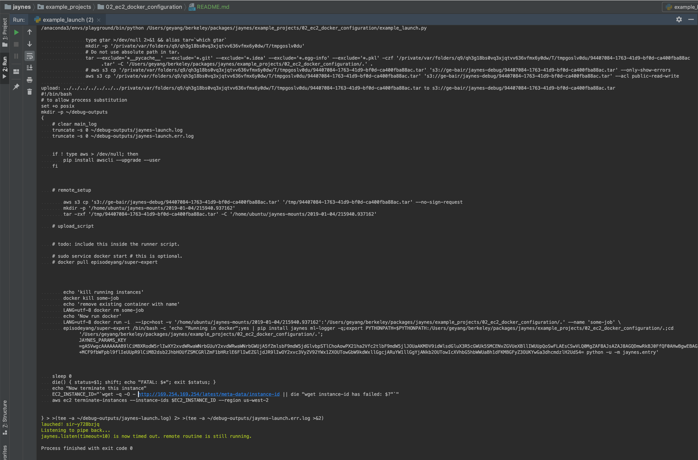

# Launching EC2 Jobs with Docker

This folder contains a working example for launching jobs on EC2 with docker containers

result looks like:



## Getting Started

You need to have `awscli` installed on your computer, as well as `jaynes`.
```bash
yes | pip install awscli boto3
yes | pip install jaynes==0.6.4
```

## Setting up your AWS Bucket

Take a look at the configuration file below, you need to have replace the following configurations for your machine:
```yaml
version: 0
cloud: # this is just a random key I used in yaml to hold this fragment.
  ec2: &ec2 # missing profile/credential selection
    region: &region us-west-2
    image_id: ami-bd4fd7c5
    key_name: ge-berkeley
    security_group: torch-gym-prebuilt
    instance_type: c5.xlarge
    spot_price: 0.6
    iam_instance_profile_arn: arn:aws:iam::055406702465:instance-profile/main
mounts:
  - !mounts.S3Code
    s3_prefix: s3://ge-bair/jaynes-debug
    local_path: .
    host_path: /home/ubuntu/jaynes-mounts/{NOW:%Y-%m-%d}/{NOW:%H%M%S.%f}
    pypath: true
    excludes: "--exclude='*__pycache__' --exclude='*.git' --exclude='*.idea' --exclude='*.egg-info' --exclude='*.pkl'"
    compress: true
runner:
  !runners.Docker
  name: "some-job"  # only for docker
  image: "episodeyang/super-expert"
  startup: yes | pip install jaynes ml-logger -q
  envs: "LANG=utf-8"
  pypath: "{mounts[0].container_path}"
  launch_directory: "{mounts[0].container_path}"
  ipc: host
  use_gpu: false
host:
  region: *region
  terminate_after: true
launch:
  type: ec2
  <<: *ec2  # this is called a yaml segment (&ec2 is the anchor).
```

When you run the [./example_launch.py](launch_entry.py) script, it generates two pieces of script:
> **A local script** and **a remote host script**

Then when you call `jaynes.run(fn, **keyword_arguments)`, `jaynes` sends uses `boto3` to launch an aws spot/on-demand 
instance, and attaches the script to the launch request. When the instance is ready, it would automatically run this
attacked launch script.

You can take a peek at this script by setting `verbose=True` in the `jaynes.config` call, or you can add this 
`verbose` flag to the yaml file.

Now, because the instance will take a few minutes to boot up, you won't be seeing real-time pipe-back in this 
configuration.

Here is the ec2 instance inside AWS console:


